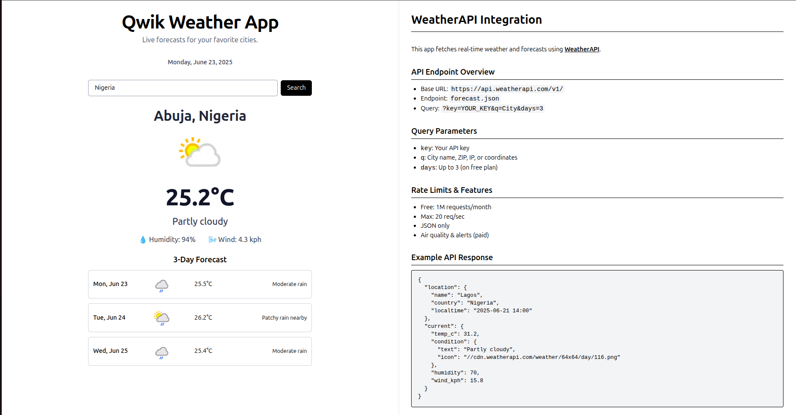

# 🌤️ Qwik Weather App  
A Real-Time Weather Forecasting Experience  

Welcome to the **Qwik Weather App** — a cutting-edge weather dashboard built using the ultra-fast **Qwik** framework and styled with **Tailwind CSS**. Designed for speed, accuracy, and simplicity, this app leverages the **WeatherAPI** to provide detailed weather insights for selected cities with real-time search and a responsive UI.



---

##  Key Features  

- **Live City Weather Search** – Instantly fetch current weather conditions for any selected city using real-time dropdown.
- **Built with Qwik** – Achieve ultra-fast performance using Qwik's resumability and server-side rendering.
- **Sleek UI** – Built with Tailwind CSS to ensure a polished, professional, and mobile-responsive design.
- **Forecast** – View a comprehensive forecast including temperature, condition, humidity, and wind speed.
- **️Weather Icons & Data** – Integrated dynamic weather icons and detailed condition texts from the API.
- **Input Validation** – Schema-based validation using **Valibot** ensures accurate and safe queries.

---

## Tech Stack

| Technology       | Purpose                                          |
|------------------|--------------------------------------------------|
| **Qwik**         | Ultra-fast web framework for reactive interfaces |
| **Tailwind CSS** | Utility-first CSS framework for clean design     |
| **WeatherAPI**   | Free real-time weather data provider             |
| **Valibot**      | Type-safe validation for input forms             |

---

## 🌐 API Information: WeatherAPI  

- **Base URL:** `https://api.weatherapi.com/v1`  
- **Endpoints Used:**
  - `current.json` → Get current weather  
  - `forecast.json` → 3-day weather forecast  
- **Example Call:**
```bash
GET https://api.weatherapi.com/v1/forecast.json?key=YOUR_KEY&q=London&days=3
```

[WEATHER API Docs](https://www.weatherapi.com/docs/)

---

## Setup Instructions :

### 1️⃣ Clone the Repository
```bash
git clone https://github.com/your-username/qwik-weather-app.git
cd qwik-weather-app
```

### 2️⃣ Install Dependencies
```bash
npm install
```

### 3️⃣ Configure Weather API Key  
- Sign up at [https://www.weatherapi.com/](https://www.weatherapi.com/)  
- Get your **free API key** from the dashboard  

#### Add `.env` in the root:

```env
PUBLIC_WEATHER_API_KEY=your_api_key_here
```

>  **Important:** Never commit your API keys. Ensure `.env` is listed in `.gitignore`.

---

##  Acknowledgements  

- **Qwik** – For blazing-fast, resumable apps  
- **Tailwind CSS** – For responsive and modern UI  
- **WeatherAPI** – For reliable and detailed weather data  
- **Valibot** – For type-safe schema validation  
- **Qwik Community** – For ongoing help and feedback  

---

## Author

Made by **Abinaya**  
> Feel free to fork, contribute, or ⭐ the repo!
> Thank You !